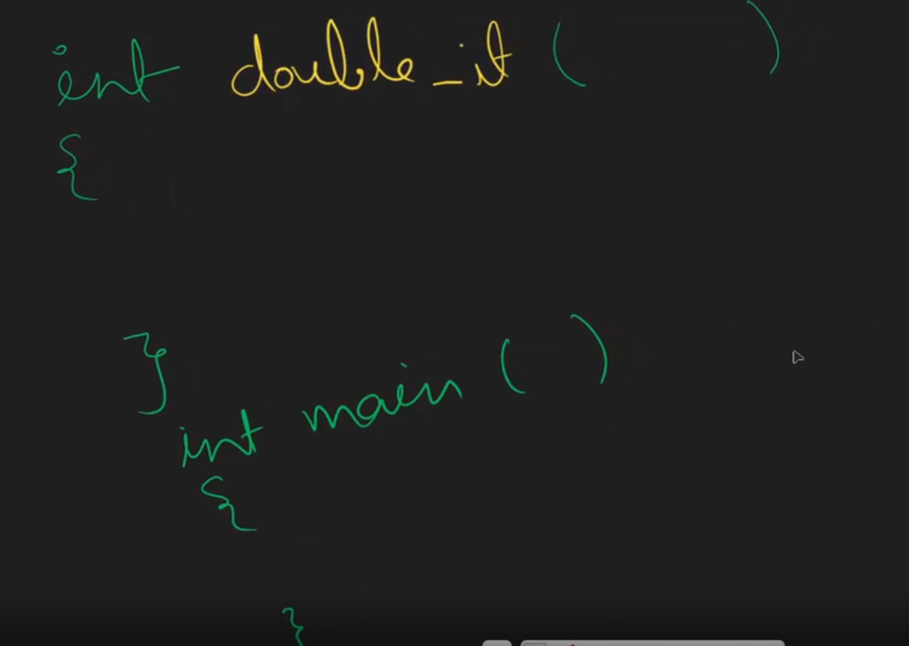
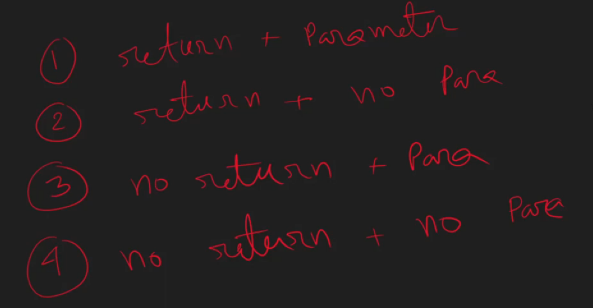

# MODULE-14-FUNCTION-IN-C






- return + parameter 
```c
#include <stdio.h>
int sum(int a, int b)
{
    return a + b;
}
int subtract(int a, int b)
{
    return a - b;
}
int main()
{
    int a,b;
    scanf("%d %d", &a, &b);
    int val = sum(a,b);
    printf("sum : %d\n", val);
    int result = sum(5, 10);
    printf("Sum: %d\n", result);
    result = subtract(10, 5);
    printf("Subtract: %d\n", result);
    return 0;
}
```


- after execution function is removed from the stack memory 


- return + no parameter 

```c
#include <stdio.h>

int sum()
{
    int a, b;
    scanf("%d %d", &a, &b);
    int ans = a + b;
    return ans;
}

int main()
{
    int ans = sum();
    printf("Sum: %d\n", ans);
    return 0;
}
```

- no return + parameter

```c
#include <stdio.h>
void sum(int a, int b)
{
    int ans = a + b;
    printf("%d\n", ans);
}

int main()
{
    int a, b;
    scanf("%d %d", &a, &b);
    sum(a, b);
    return 0;
}
```
- we can return any time but we cant5 return value if we use void 

```c
#include <stdio.h>
void sum(int a, int b)
{
    int ans = a + b;
    return;
    //  this print will not show aS WE HAVE RETURNED 
    printf("%d\n", ans);
}

int main()
{
    int a, b;
    scanf("%d %d", &a, &b);
    sum(a, b);
    return 0;
}

```


- no parameter no return 

```c
#include <stdio.h>
void sum()
{
    int a, b;
    scanf("%d %d", &a, &b);
    int ans = a + b;
    printf("%d\n", ans);
}

int main()
{
    sum();
    return 0;
}
```

- understanding of scope 

```c

#include <stdio.h>
 int y = 21; // this is global scoped we can access this variable from any function in this file

void sum()
{
    int x = 20; // this is function scoped
    printf("Function Variable : %d\n", x);
    printf("Global Variable : %d\n", y);
}

int main()
{
    int x = 10; // this is main function scoped
    printf("Main Function Variable : %d\n", x);
    printf("Global Variable accessed in main : %d\n", y);
    sum();
    return 0;
}
```

- we have two type of function `builtin function` and `user defined function`
- some useful mathematical functions

```c
#include <stdio.h>
#include <math.h>

int main()
{
    // ceil() function
    double num1 = 3.14;
    double ceil_num1 = ceil(num1);
    // floor() function
    double floor_num2 = floor(num1);
    // round() function
    double round_num3 = round(num1);
    // sqrt() function
    double num2 = 16.0;
    double sqrt_num2 = sqrt(num2);
    // pow() function
    double base = 2.0;  
    double exponent = 3.0;
    double pow_result = pow(base, exponent);
    // abs() function
    int num3 = -5;
    int abs_num3 = abs(num3);
    printf("Ceil of %.2f is %.2f\n", num1, ceil_num1);
    printf("Floor of %.2f is %.2f\n", num1, floor_num2);
    printf("Round of %.2f is %.2f\n", num1, round_num3);
    printf("Sqrt of %.2f is %.2f\n", num2, sqrt_num2);
    printf("%.2f raised to the power of %.2f is %.2f\n", base, exponent, pow_result);
    printf("Absolute value of %d is %d\n", num3, abs_num3);
    return 0;
}
```
